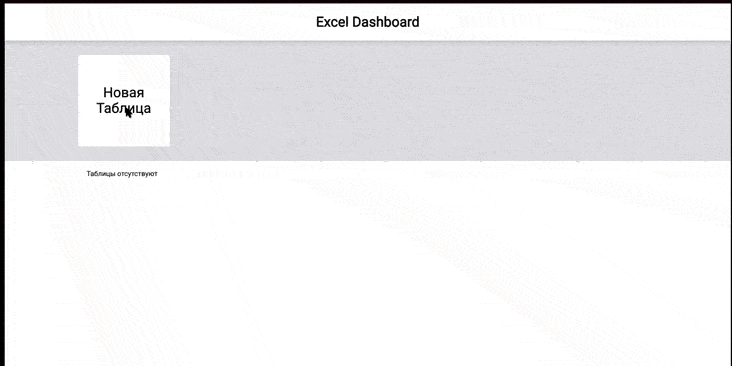

Стэк технологий: JavaScript.
# Проект по курсу "JavaScript"
## Автор курса: Владилен Минин

### Описание изученного материала:
1. Построение рабочего окружение с Webpack.
2. Создание своего фреймворка с нуля.
3. ООП.
4. Redux с нуля.
5. Routing.

#### Проект "Excel" 

Функционал приложения:
* Реализован частичный функционал Excel с возможностью масштабирования.
* 